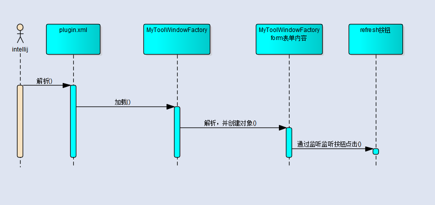
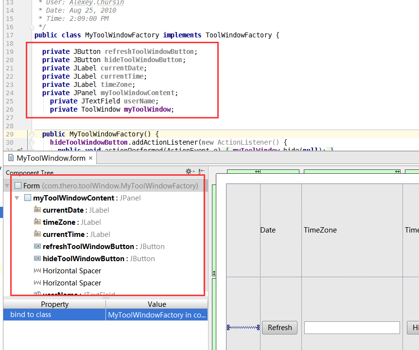

### intellij idea 开发 intellij idea 开发

在intelij idea的工具栏中添加一个显示时间的工具，显示效果如下


### 代码结构


### 代码明细
#### 显示设置
```xml
<?xml version="1.0" encoding="UTF-8"?>
<form xmlns="http://www.intellij.com/uidesigner/form/" version="1" bind-to-class="myToolWindow.MyToolWindowFactory">
  <grid id="27dc6" binding="myToolWindowContent" layout-manager="GridLayoutManager" row-count="2" column-count="5" same-size-horizontally="false" same-size-vertically="false" hgap="-1" vgap="-1">
    <margin top="0" left="0" bottom="0" right="0"/>
    <constraints>
      <xy x="20" y="20" width="500" height="400"/>
    </constraints>
    <properties/>
    <border type="none"/>
    <children>
      <component id="9aa3f" class="javax.swing.JLabel" binding="currentDate">
        <constraints>
          <grid row="0" column="1" row-span="1" col-span="1" vsize-policy="0" hsize-policy="0" anchor="8" fill="0" indent="0" use-parent-layout="false"/>
        </constraints>
        <properties>
          <text value="Date"/>
        </properties>
      </component>
      <component id="44be3" class="javax.swing.JLabel" binding="timeZone">
        <constraints>
          <grid row="0" column="2" row-span="1" col-span="1" vsize-policy="0" hsize-policy="0" anchor="8" fill="0" indent="0" use-parent-layout="false"/>
        </constraints>
        <properties>
          <text value="TimeZone"/>
        </properties>
      </component>
      <component id="f02af" class="javax.swing.JLabel" binding="currentTime">
        <constraints>
          <grid row="0" column="3" row-span="1" col-span="1" vsize-policy="0" hsize-policy="0" anchor="8" fill="0" indent="0" use-parent-layout="false"/>
        </constraints>
        <properties>
          <text value="Time"/>
        </properties>
      </component>
      <component id="5fceb" class="javax.swing.JButton" binding="refreshToolWindowButton">
        <constraints>
          <grid row="1" column="1" row-span="1" col-span="1" vsize-policy="0" hsize-policy="3" anchor="0" fill="1" indent="0" use-parent-layout="false"/>
        </constraints>
        <properties>
          <text value="Refresh"/>
        </properties>
      </component>
      <component id="3edc1" class="javax.swing.JButton" binding="hideToolWindowButton">
        <constraints>
          <grid row="1" column="3" row-span="1" col-span="1" vsize-policy="0" hsize-policy="3" anchor="0" fill="1" indent="0" use-parent-layout="false"/>
        </constraints>
        <properties>
          <text value="Hide"/>
        </properties>
      </component>
      <hspacer id="8bf9c">
        <constraints>
          <grid row="1" column="0" row-span="1" col-span="1" vsize-policy="1" hsize-policy="6" anchor="0" fill="1" indent="0" use-parent-layout="false"/>
        </constraints>
      </hspacer>
      <hspacer id="26841">
        <constraints>
          <grid row="1" column="4" row-span="1" col-span="1" vsize-policy="1" hsize-policy="6" anchor="0" fill="1" indent="0" use-parent-layout="false"/>
        </constraints>
      </hspacer>
    </children>
  </grid>
</form>
```
#### 页面显示内容控制
```java
package com.thero.toolWindow;

import com.intellij.openapi.project.Project;
import com.intellij.openapi.wm.*;
import com.intellij.ui.content.*;

import javax.swing.*;
import java.awt.event.*;
import java.util.Calendar;

/**
 * Created by IntelliJ IDEA.
 * User: Alexey.Chursin
 * Date: Aug 25, 2010
 * Time: 2:09:00 PM
 */
public class MyToolWindowFactory implements ToolWindowFactory {

  private JButton refreshToolWindowButton;
  private JButton hideToolWindowButton;
  private JLabel currentDate;
  private JLabel currentTime;
  private JLabel timeZone;
  private JPanel myToolWindowContent;
  private ToolWindow myToolWindow;


  public MyToolWindowFactory() {
    hideToolWindowButton.addActionListener(new ActionListener() {
      public void actionPerformed(ActionEvent e) {
        myToolWindow.hide(null);
      }
    });
    refreshToolWindowButton.addActionListener(new ActionListener() {
      public void actionPerformed(ActionEvent e) {
        MyToolWindowFactory.this.currentDateTime();
      }
    });
  }

  // Create the tool window content.
  public void createToolWindowContent(Project project, ToolWindow toolWindow) {
    myToolWindow = toolWindow;
    this.currentDateTime();
    ContentFactory contentFactory = ContentFactory.SERVICE.getInstance();
    Content content = contentFactory.createContent(myToolWindowContent, "", false);
    toolWindow.getContentManager().addContent(content);

  }

  public void currentDateTime() {
    // Get current date and time
    Calendar instance = Calendar.getInstance();
    currentDate.setText(String.valueOf(instance.get(Calendar.DAY_OF_MONTH)) + "/"
                        + String.valueOf(instance.get(Calendar.MONTH) + 1) + "/" +
                        String.valueOf(instance.get(Calendar.YEAR)));
    getClass().getResource("/");
    currentDate.setIcon(new ImageIcon(getClass().getResource("/com/thero/icon/Calendar-icon.png")));
    int min = instance.get(Calendar.MINUTE);
    String strMin;
    if (min < 10) {
      strMin = "0" + String.valueOf(min);
    } else {
      strMin = String.valueOf(min);
    }
    currentTime.setText(instance.get(Calendar.HOUR_OF_DAY) + ":" + strMin);
    currentTime.setIcon(new ImageIcon(getClass().getResource("/com/thero/icon/Time-icon.png")));
    // Get time zone
    long gmt_Offset = instance.get(Calendar.ZONE_OFFSET); // offset from GMT in milliseconds
    String str_gmt_Offset = String.valueOf(gmt_Offset / 3600000);
    str_gmt_Offset = (gmt_Offset > 0) ? "GMT + " + str_gmt_Offset : "GMT - " + str_gmt_Offset;
    timeZone.setText(str_gmt_Offset);
    timeZone.setIcon(new ImageIcon(getClass().getResource("/com/thero/icon/Time-zone-icon.png")));
  }

}

```
#### 将插件添加到`plugin.xml`内,该文件时插件启动的源头，插件成功添加后，将会加载`MyToolWindowFactory`类
```xml
<extensions defaultExtensionNs="com.intellij">
  <toolWindow id="Sample Calendar" secondary="true" icon="/com/thero/icon/plus.png"    anchor="right" factoryClass="com.thero.toolWindow.MyToolWindowFactory">  </toolWindow>
</extensions>
```
下面的图是个人理解的启动过程


### 注意问题


 1、`factoryClass` 该class的包地址需要指定正确,另外注意图片的位置，xml读取文件的目录是`src`开始的，定义toolWindow时，需要实现一个借口`implements ToolWindowFactory`
```xml
<toolWindow id="Sample Calendar" secondary="true" icon="/com/thero/icon/plus.png"  anchor="right" factoryClass="com.thero.toolWindow.MyToolWindowFactory">></toolWindow>
```
2、`toolWindow`该功能是在`intellij idea` 的左下角添加一个工具条；`anchor`是配置该`toolwindow`被点击的时
显示的所在的位置，如果是`right`那么他会在该工具的右侧显示   
3、`id`不能够在`plugin.xml`重复否则会报错  
4、 `form`文件中需要指定正确的`class`，如果指定错误将会报出`nullpointexception`


5、`form`与`factory`之间的关系,`form`定义的元素名称和`myToolWindowFactory`定义的变量名称一致；  

6、在`myToolWindowFactory`构造器中可以对按钮添加绑定事件，当按钮被点击时将会被触发，示例：
```java
 hideToolWindowButton.addActionListener(new ActionListener() {
      public void actionPerformed(ActionEvent e) {
        myToolWindow.hide(null);
      }
    });
    refreshToolWindowButton.addActionListener(new ActionListener() {
      public void actionPerformed(ActionEvent e) {
        MyToolWindowFactory.this.currentDateTime();
      }
    });
```

### 常用方法总计
a、 每一个toolWindow在创建的时候都会有一个`private ToolWindow myToolWindow;`对象通过该对象可以获得`form`
定义的元素   
b、 关闭打开的`toolWindow`
` myToolWindow.hide(null);`   
c、如何在`toolWindow`添加一个图片和内容
```java
 private JLabel currentDate;
 currentDate.setIcon(new ImageIcon(getClass().getResource("/com/thero/icon/Calendar-icon.png")));
  currentDate.setText(String.valueOf(instance.get(Calendar.DAY_OF_MONTH)) + "/"
                         + String.valueOf(instance.get(Calendar.MONTH) + 1) + "/" +
                         String.valueOf(instance.get(Calendar.YEAR)));
```

